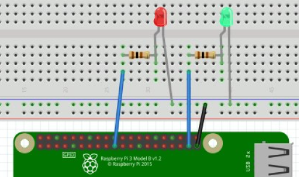
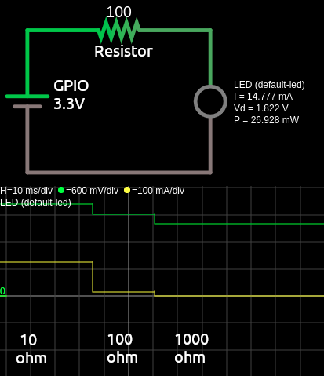

# [STEM Just 4 U Home Page](https://stemjust4u.com/)
# This project shows multiple methods to turn an LED on/off with Raspberry Pi and ESP32.

[Link to Project Web Site](https://stemjust4u.com/p1-led-blink)
## Materials 
* LED (1.7-3V/20mA LED)
* Resistor (75-100ohm) - controls current going to LED
* Raspberry Pi and/or esp32

>Ohms law V=IR  
KCL - Sum of current flowing into a node is equal to sum of current flowing out of that node  
KVL - Sum of voltage around a closed loop is zero.  
Sum of inputs is equal to the sum of Voltage drops.  
More on series and parallel circuits at [sparkfun](https://learn.sparkfun.com/tutorials/series-and-parallel-circuits)

Voltage drop for a typical LED will be around 1.8V and can only handle around 20mA (double check the datasheet for your specific LED). The GPIO pins on a Raspberry Pi only output ~15mA so if you connect an LED directly it works and doesn't burn out. But it is best to do it correctly and insert a current limiting resistor. Make sure the polarity is connected correctly on an LED. Anode (longer leg) is positive, cathode is negative.

>Kirchoff Voltage Law (KVL) - Voltage drop across resistor and LED should equal sum of input Voltage.
Vs = Vled + Vresistor

We know the Vsource (GPIO) and LED voltage drop current draw from datasheet (and you can use a multimeter to double check)
Vs = 3.3V (GPIO)
Vled = 1.8V
Iled = 20mA

So Vresistor = 3.3V - 1.8V = 1.5V

We want to limit the current to <20mA (LED datasheet).  
>Kirchoff Current Law (KCL) - Our circuit is a single path so current will be equal across the LED and resistor. Iled = Iresistor (20mA)

Ohms Law for the resistor
R = V/I = 1.5V/.02A = 75ohm (I only had a 100ohm resist so my diagrams show 100ohm, resulting in a lower current, 15mA, and a slightly dimmer LED)

Many STEM project LEDs have ~3V drop. For these the math comes out to a nearly 0 ohm resistor and you could leave it out.

>A quick check that your LED is working can be done by connecting it to the 3.3V pin on your Pi.

# Connecting the LED to Raspberry Pi
A great resource for Raspberry Pi pins is pinout.xyz.   
(or type command $ pinout on your raspberry pi)  
You can use a breadboard or connect the LED/resistor directly with jumper wires.
For my setup I used two LEDs and GPIO10 and 26. (along with GRND) Start with a single LED and get it working first.

# Connecting LED to esp32
On the ESP32 I used the internal LED (pin2). Although you could connect an external LED and just change the pin.  
You load the upython script on to the esp32 as /main.py  [Directions using Thonny](https://stemjust4u.com/esp32-esp8266)

# Code (single LED)
​​For initial LED blink code I tried out a couple Python libraries and even JavaScript. 
* RPi - Python with RPi.GPIO
* RPi - Python with gpiozero
* RPi - JavaScript
* esp32 - uPython

Note - the github/venve/vscode steps aren't required. You can install the Python libraries in your home directory, create the Python script in a text editor and execute from command line.

1. Initialize an empty github repository with a README and .gitignore (python)
2. Go to RPi directory and clone  
`$ git clone git@github.com:user/repo.git` (ssh copied from github)
3. ​​Create virtual env  
`$ python3 -m venv .venv`  
`$ source .venv/bin/activate`
4. Install packages  
`(.venv)$ pip3 install RPi.GPIO`  
`(.venv)$ pip3 install gpiozero`  

# **Now you can start creating the beginner code to blink the led.**
See /gpiozero-blink.py (uses gpiozero)  
See /rpigpio/rpigpio-blink.py (uses RPi.GPIO)

---
## JavaScript you will need node.js installed.
I followed the w3schools javascript tutorial  
Install onoff with  
`$ npm install onoff`  
Run your code with  
`$ node rpi-blink.js`

# More Code (multi LEDs with a Class object)
A simple script makes sense for blinking a single LED. But what if you wanted to connect 2,3,4 or more LEDs? And you are wanting to call it in other projects with just a couple lines of code. So the code needs to be organized and have a single object that holds all the LED information with functions (methods) that are easily called to turn all LEDs on or off. That is when the OOP (object oriented programming) comes in. Building an LED class (object) in its own module and making methods to turn them on/off is a good opportunity to practice OOP and create your own module.

Here is how I approached it  
/example.py  
|- rpigpio (packge/folder)  
|         |-- __init_.py  
|         |-- led.py (module)  

​​The rpigpio package (folder) contains a __init__.py and led.py module  
The led.py module can be executed standalone ($ python3 led.py) for testing.  
If you wanted to have this program start up at boot as a systemd service the logging function could be used for trouble shooting.  

The example.py script can be ran with  
`$ python3 example.py`  
Or an intial ON or OFF state can be passed (that is the sys.argv portion)  
`$ python3 example.py ON`